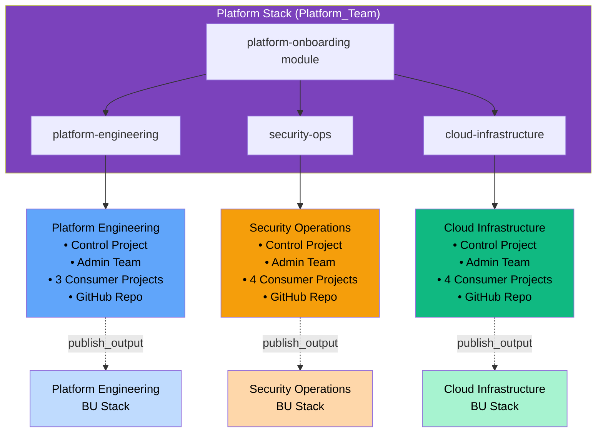

# Platform Onboarding Module

Terraform module for onboarding business units to HCP Terraform with **automated GitHub repository creation** for BU-owned Terraform Stacks.

## Overview

This module is designed for **platform teams** to provision HCP Terraform infrastructure for business units, including:

- ✅ **BU Control Projects** - Dedicated projects per business unit (e.g., `plat-eng_kubernetes-platform`)
- ✅ **Admin Teams & Tokens** - Team-based access control with API tokens (e.g., `platform-engineering_admin`)
- ✅ **Control Workspaces** - Workspace management infrastructure
- ✅ **Variable Sets** - Centralized configuration management with project-specific variables
- ✅ **Consumer Projects** - Application-specific projects from YAML configuration content
- ✅ **Automated GitHub Repository Creation** - Creates turnkey BU Stack repositories with seeded configurations
- ✅ **GitHub Teams & Access** - BU admin teams with repository permissions
- ✅ **Branch Protection** - Enforces code review and CI checks (optional)

**Perfect for IT teams**: Platform Engineering, Security Operations, Cloud Infrastructure, DevOps, SRE, and more.

## Features

### Core Infrastructure
- Creates BU-specific control projects with naming: `BU_{bu_name}` (e.g., `BU_platform-engineering`)
- Creates admin teams: `{bu_name}_admin` (e.g., `platform-engineering_admin`)
- Generates team tokens for BU authentication
- Creates control workspaces: `{bu_name}_workspace_control`
- Provisions variable sets with project IDs and tokens

### Consumer Projects (YAML-Driven)
- Accepts YAML content via `yaml_config_content` variable (embedded in Stack deployments)
- Creates consumer projects with abbreviated names: `{bu_short}_{project_name}` (e.g., `plat-eng_kubernetes-platform`)
- Grants BU admin teams access to all projects
- Creates project-specific variable sets with configured variables
- Processes project-level variables from YAML (supports HCL values, sensitive flags, descriptions)

### GitHub Integration (NEW!)
- **Automatically creates GitHub repositories** for each BU's Terraform Stack
- **Seeds 8+ configuration files** in each repository:
  - `README.md` - Complete BU-specific documentation
  - `variables.tfcomponent.hcl` - Stack input variables
  - `providers.tfcomponent.hcl` - TFE provider with OIDC
  - `components.tfcomponent.hcl` - Component sourcing bu-onboarding module
  - `outputs.tfcomponent.hcl` - Stack outputs
  - `deployments.tfdeploy.hcl` - Dev/staging/prod deployments with upstream inputs
  - `configs/{bu_name}.yaml` - Example workspace configuration
  - `.github/workflows/terraform-stacks.yml` - CI/CD workflow
- **Creates GitHub teams** for BU admins
- **Grants admin access** to BU repositories
- **Enables branch protection** on main branch (optional)

### Enhanced Outputs for Stacks
- Structured outputs optimized for `publish_output` in Terraform Stacks
- Maps of BU project IDs, tokens, workspaces, GitHub repos
- Comprehensive `bu_infrastructure` output for downstream consumption

## Architecture

This module is designed for the **Terraform Stacks linked stacks pattern** with IT teams:



### How It Works

1. **Platform Stack** runs in the `Platform_Team` project with 3 deployments (one per IT team)
2. Each deployment provides YAML configuration content with team-specific consumer projects
3. Module creates control project, admin team, and consumer projects for each IT team
4. Module seeds GitHub repositories with complete Stack configurations
5. IT teams can then manage their own workspaces using the BU Stack repositories

### Linked Stacks Pattern

```
┌─────────────────────────────────────────────────────────────┐
│ Platform Stack (Platform_Team project)                      │
│                                                              │
│  Component: platform-onboarding (this module)               │
│  ├─ Creates: BU projects, teams, tokens                     │
│  ├─ Creates: GitHub repos with seeded Stack configs         │
│  └─ Publishes: bu_infrastructure output                     │
│                                                              │
│  Deployments:                                               │
│    ├─ platform-engineering (publish_output)                 │
│    ├─ security-ops (publish_output)                         │
│    └─ cloud-infrastructure (publish_output)                 │
└─────────────────────────────────────────────────────────────┘
                              ↓
                    (publish_output → upstream_input)
                              ↓
┌─────────────────────────────────────────────────────────────┐
│ BU Stack (tfc-platform-engineering-bu-stack repo)           │
│                                                              │
│  Component: bu-onboarding                                   │
│  ├─ Upstream: bu_project_id, bu_admin_token                 │
│  ├─ Reads: YAML workspace configuration                     │
│  └─ Creates: Workspaces from YAML                           │
│                                                              │
│  Deployments:                                               │
│    ├─ dev (BU_platform-engineering project)                 │
│    ├─ staging (BU_platform-engineering project)             │
│    └─ production (BU_platform-engineering project)          │
└─────────────────────────────────────────────────────────────┘
```

## Requirements

| Name | Version |
|------|---------|
| terraform | >= 1.13.5 |
| tfe | ~> 0.60 |
| github | ~> 6.0 |

**IMPORTANT**: This module does NOT include provider blocks. When using with Terraform Stacks, configure providers in your Stack's `providers.tfcomponent.hcl` file.

## Usage

### Basic Example (Without GitHub Integration)

```hcl
module "platform_onboarding" {
  source = "app.terraform.io/cloudbrokeraz/platform-onboarding/tfe"
  
  tfc_organization_name = "cloudbrokeraz"
  
  # Optional: Filter to single BU
  # business_unit = "finance"
  
  # Disable GitHub features
  create_bu_repositories = false
}
```

### Complete Example (Terraform Stacks with Embedded YAML)

**In your Stack's `deployments.tfdeploy.hcl`:**

```hcl
# Store for GitHub token
store "varset" "platform_team_config" {
  name     = "platform_team"
  category = "terraform"
}

# Embed YAML configuration content
locals {
  platform_engineering_yaml = <<-EOT
    business_unit: platform-engineering

    bu_projects:
      - project_name: kubernetes-platform
        project_description: Kubernetes cluster management and operations
        var_sets:
          variables:
            - key: environment
              value: production
              description: Deployment environment
            - key: team
              value: platform-k8s
            - key: aws_region
              value: us-east-1
            - key: cluster_version
              value: "1.28"
              description: Kubernetes version
              sensitive: false

      - project_name: service-mesh
        project_description: Service mesh infrastructure and observability
        var_sets:
          variables:
            - key: environment
              value: production
            - key: team
              value: platform-mesh
            - key: enable_tracing
              value: "true"
              hcl: true
  EOT
}

# Deployment for Platform Engineering team
deployment "platform-engineering" {
  inputs = {
    tfc_organization_name = "cloudbrokeraz"
    business_unit         = "platform-engineering"
    
    # Pass YAML content (file() not available in .tfdeploy.hcl)
    yaml_config_content = local.platform_engineering_yaml
    
    # GitHub configuration
    create_bu_repositories   = true
    github_organization      = "hashi-demo-lab"
    github_token             = store.varset.platform_team_config.github_token
    
    # Repository naming
    bu_stack_repo_prefix     = "tfc"
    bu_stack_repo_suffix     = "bu-stack"
    enable_branch_protection = false
    
    # Platform settings
    platform_project_name = "Platform_Team"
    commit_author_name    = "Platform Team"
    commit_author_email   = "platform-team@cloudbrokeraz.com"
  }
}
```

**In your Stack's `components.tfcomponent.hcl`:**

```hcl
component "platform_onboarding" {
  source  = "app.terraform.io/cloudbrokeraz/platform-onboarding/tfe"
  version = "main"  # or specific version tag
  
  inputs = {
    # TFC Organization
    tfc_organization_name = var.tfc_organization_name
    
    # Optional: Filter to single business unit
    business_unit = var.business_unit
    
    # YAML Configuration Content (passed from deployment)
    yaml_config_content = var.yaml_config_content
    
    # GitHub Configuration
    create_bu_repositories = var.create_bu_repositories
    github_organization    = var.github_organization
    github_token           = var.github_token
    bu_stack_repo_prefix   = var.bu_stack_repo_prefix
    bu_stack_repo_suffix   = var.bu_stack_repo_suffix
    
    # HCP Terraform Stacks (managed separately)
    create_hcp_stacks  = false
    vcs_oauth_token_id = ""
    
    # Platform Configuration
    platform_stack_project = var.platform_project_name
    
    # GitHub Settings
    github_team_privacy      = "closed"
    enable_branch_protection = var.enable_branch_protection
    
    # Commit Author
    commit_author_name  = var.commit_author_name
    commit_author_email = var.commit_author_email
  }
  
  providers = {
    tfe    = provider.tfe.this
    github = provider.github.this
  }
}
```

This will create:
- Control project: `BU_platform-engineering`
- Admin team: `platform-engineering_admin`
- Consumer projects: `plat-eng_kubernetes-platform`, `plat-eng_service-mesh`
- GitHub repository: `tfc-platform-engineering-bu-stack`
- Variable sets with configured variables for each project

### YAML Configuration Example

The `yaml_config_content` variable accepts YAML with this structure:

```yaml
business_unit: platform-engineering

bu_projects:
  - project_name: kubernetes-platform
    project_description: Kubernetes cluster management and operations
    
    var_sets:
      variables:
        - key: environment
          value: production
          category: terraform
          description: Deployment environment
          sensitive: false
          hcl: false
        
        - key: cluster_version
          value: "1.28"
          description: Kubernetes version
        
        - key: enable_monitoring
          value: "true"
          hcl: true  # Treat as HCL expression
    
    workspaces:
      - workspace_name: k8s-prod-us-east-1
        workspace_description: Production Kubernetes cluster
        terraform_version: "1.9.0"
        working_directory: "terraform/"
        vcs_repo:
          identifier: "hashi-demo-lab/kubernetes-infra"
          branch: "main"
```

**Key Fields:**
- `business_unit` (required): Team identifier (e.g., `platform-engineering`, `security-ops`)
- `bu_projects` (required): List of consumer projects
  - `project_name` (required): Project identifier (used in abbreviated names)
  - `project_description` (required): Human-readable description
  - `var_sets.variables`: Optional variables for project-specific variable set
  - `workspaces`: Optional workspace definitions (used by bu-onboarding module)

**Variable Options:**
- `key`: Variable name
- `value`: Variable value (as string)
- `category`: `terraform` or `env` (default: `terraform`)
- `description`: Human-readable description
- `sensitive`: Mark as sensitive (default: `false`)
- `hcl`: Treat value as HCL expression (default: `false`)

**Note**: In Terraform Stacks, you cannot use `file()` in `.tfdeploy.hcl` files. Embed YAML content using heredoc strings (`<<-EOT ... EOT`) in the `locals` block as shown in the example above.

## Providers

Providers are **NOT** configured in this module. Configure them in your Terraform Stack:

```hcl
# In your Stack's providers.tfcomponent.hcl

required_providers {
  tfe = {
    source  = "hashicorp/tfe"
    version = "~> 0.60"
  }
  github = {
    source  = "integrations/github"
    version = "~> 6.0"
  }
}

provider "tfe" "this" {
  config {
    hostname = "app.terraform.io"
    token    = var.tfe_identity_token  # OIDC token
  }
}

provider "github" "this" {
  config {
    owner = "CloudbrokerAz"
    token = var.github_token
  }
}
```

## Inputs

| Name | Description | Type | Default | Required |
|------|-------------|------|---------|:--------:|
| tfc_organization_name | HCP Terraform organization name | `string` | n/a | yes |
| yaml_config_content | YAML configuration content as string | `string` | n/a | yes |
| business_unit | Filter to single business unit (null = all BUs) | `string` | `null` | no |
| create_bu_repositories | Create GitHub repositories for BU Stacks | `bool` | `true` | no |
| github_token | GitHub personal access token | `string` | `""` | no |
| github_organization | GitHub organization name | `string` | `""` | no |
| bu_stack_template_repo | Template repo (format: org/repo) | `string` | `""` | no |
| bu_stack_repo_prefix | Repository name prefix | `string` | `"tfc"` | no |
| bu_stack_repo_suffix | Repository name suffix | `string` | `"bu-stack"` | no |
| create_hcp_stacks | Create HCP Terraform Stacks | `bool` | `false` | no |
| vcs_oauth_token_id | VCS OAuth token ID | `string` | `""` | no |
| platform_stack_project | Platform stack project name | `string` | `"Platform_Team"` | no |
| github_team_privacy | GitHub team privacy (closed/secret) | `string` | `"closed"` | no |
| enable_branch_protection | Enable branch protection on main | `bool` | `true` | no |
| commit_author_name | Git commit author name | `string` | `"Platform Team"` | no |
| commit_author_email | Git commit author email | `string` | `"platform-team@cloudbrokeraz.com"` | no |

## Outputs

### Core Outputs
| Name | Description |
|------|-------------|
| organization_name | HCP Terraform organization name |
| business_units | List of business units |
| deployment_summary | Resource creation summary |

### BU Infrastructure Outputs (for publish_output)
| Name | Description |
|------|-------------|
| bu_project_ids_map | Map of BU names to project IDs |
| bu_admin_tokens | Map of BU names to admin tokens (sensitive) |
| bu_infrastructure | Complete structured output per BU |

### GitHub Outputs
| Name | Description |
|------|-------------|
| bu_stack_repo_names | Map of BU names to repo names |
| bu_stack_repo_urls | Map of BU names to repo URLs |
| bu_stack_clone_urls | Map of BU names to SSH clone URLs |
| bu_github_team_ids | Map of BU names to GitHub team IDs |

## GitHub Repository Naming

Repositories are created with the pattern:
```
{bu_stack_repo_prefix}-{bu_name}-{bu_stack_repo_suffix}
```

**Examples with IT teams:**
- `tfc-platform-engineering-bu-stack`
- `tfc-security-ops-bu-stack`
- `tfc-cloud-infrastructure-bu-stack`

## Project Naming Convention

Projects use abbreviated BU names to stay within the 40-character limit:

**Control Projects:**
- `BU_platform-engineering`
- `BU_security-ops`
- `BU_cloud-infrastructure`

**Consumer Projects (abbreviated):**
- `plat-eng_kubernetes-platform` (27 chars)
- `sec-ops_siem-platform` (20 chars)
- `cloud-infra_network-backbone` (27 chars)

**Abbreviation Map:**
- `platform-engineering` → `plat-eng`
- `security-ops` → `sec-ops`
- `cloud-infrastructure` → `cloud-infra`

If a business unit isn't in the abbreviation map, the first 11 characters are used.

## Template Files

The module seeds 8 files in each BU repository:

1. **README.md** - BU-specific documentation with team context
2. **variables.tfcomponent.hcl** - Stack variables (upstream inputs, YAML config)
3. **providers.tfcomponent.hcl** - TFE provider with OIDC authentication
4. **components.tfcomponent.hcl** - Component sourcing bu-onboarding module
5. **outputs.tfcomponent.hcl** - Stack outputs (workspace maps, summaries)
6. **deployments.tfdeploy.hcl** - Dev/staging/prod deployments with upstream_input from platform stack
7. **configs/{bu_name}.yaml** - Example workspace configuration for the team
8. **.github/workflows/terraform-stacks.yml** - CI/CD workflow for Stack operations

Each file is customized with the BU's name, project ID, and token references.

## Publishing to Private Module Registry

1. **Tag the repository**:
   ```bash
   git tag -a v1.0.0 -m "Release v1.0.0"
   git push origin v1.0.0
   ```

2. **Configure module in PMR**:
   - Navigate to HCP Terraform → Registry → Publish
   - Select GitHub repository
   - Choose `platform-onboarding` as module name
   - Set provider: `tfe`

3. **Reference in Stacks**:
   ```hcl
   component "platform_onboarding" {
     source  = "app.terraform.io/cloudbrokeraz/platform-onboarding/tfe"
     version = "~> 1.0"
     
     inputs = {
       tfc_organization_name = var.tfc_organization_name
       # ...
     }
   }
   ```

## Module Dependencies

### YAML Configuration Content
Pass YAML configuration as a string via `yaml_config_content` variable. In Terraform Stacks:

**❌ Don't do this** (file() not available in .tfdeploy.hcl):
```hcl
deployment "platform-engineering" {
  inputs = {
    yaml_config_content = file("./config/platform-engineering.yaml")  # Error!
  }
}
```

**✅ Do this instead** (embed as heredoc string):
```hcl
locals {
  platform_engineering_yaml = <<-EOT
    business_unit: platform-engineering
    bu_projects:
      - project_name: kubernetes-platform
        project_description: Kubernetes cluster management
  EOT
}

deployment "platform-engineering" {
  inputs = {
    yaml_config_content = local.platform_engineering_yaml  # Works!
  }
}
```

### GitHub Authentication
Required for GitHub provider:
- **Personal Access Token (PAT)** with `repo` and `admin:org` scopes
- Pass via variable set (recommended) or directly in deployment inputs
- Store in HCP Terraform variable set as sensitive value

**Example using variable set:**
```hcl
store "varset" "platform_team_config" {
  name     = "platform_team"
  category = "terraform"
}

deployment "platform-engineering" {
  inputs = {
    github_token = store.varset.platform_team_config.github_token
  }
}
```

### HCP Terraform Permissions
Required permissions:
- **Organization**: Manage projects
- **Organization**: Manage teams
- **Organization**: Manage workspaces
- **Organization**: Manage variable sets

## Troubleshooting

### "Attribute name string length must be between 3 and 40"
**Cause**: Project name exceeds 40 characters  
**Fix**: Module automatically abbreviates BU names. If using custom BU names, add to abbreviation map in `locals.tf`:
```hcl
bu_abbreviations = {
  "your-long-bu-name" = "short-name"  # Max 11 chars for abbreviation
}
```

### "This object does not have an attribute named 'project_name'"
**Cause**: YAML structure incorrect (using `name:` instead of `project_name:`)  
**Fix**: Ensure YAML uses `bu_projects:` and `project_name:` (not `projects:` and `name:`)

### "Call to unknown function 'file'"
**Cause**: Trying to use `file()` in `.tfdeploy.hcl`  
**Fix**: Embed YAML content as heredoc string in `locals` block (see examples above)

### "Repository already exists"
**Cause**: GitHub repository with same name exists  
**Fix**: Change `bu_stack_repo_prefix` or `bu_stack_repo_suffix`, or delete existing repo

### "Insufficient permissions to create team"
**Cause**: GitHub token missing `admin:org` scope  
**Fix**: Regenerate token with correct scopes (requires organization, not personal account)

### "Failed to read YAML file"
**Cause**: YAML syntax error in content  
**Fix**: Validate YAML with online validator or `yamllint`

## Related Resources

- **bu-onboarding Module**: Consumes outputs from this module
- **Platform Stack**: Stacks configuration using this module
- **BU Stack Template**: Template for BU-owned Stacks

## License

MIT License

## Support

Platform Team - `platform-team@cloudbrokeraz.com`

---

**Module Version**: 1.0.0  
**Terraform Stacks**: v1.13.5+  
**Last Updated**: 2024
